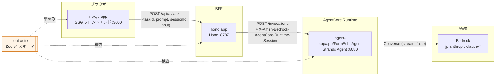
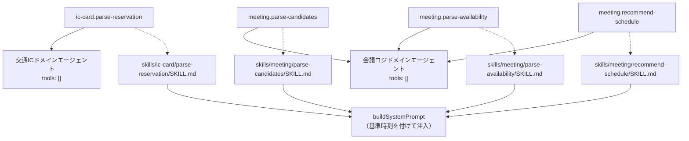
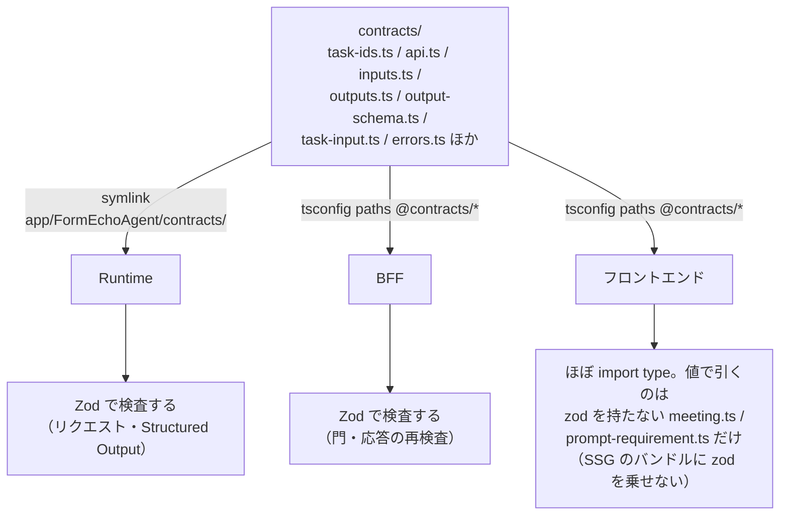
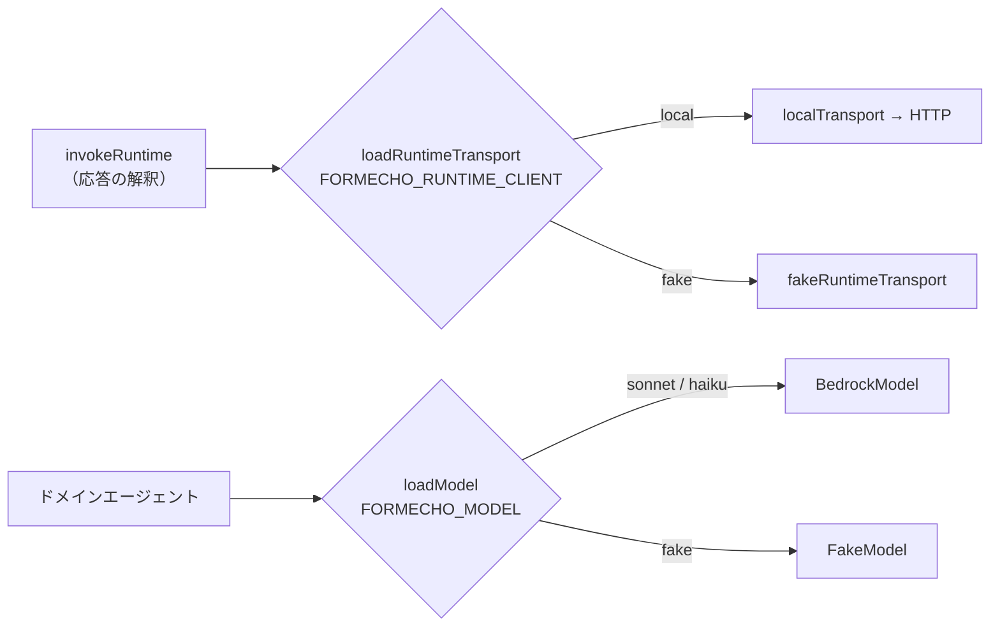
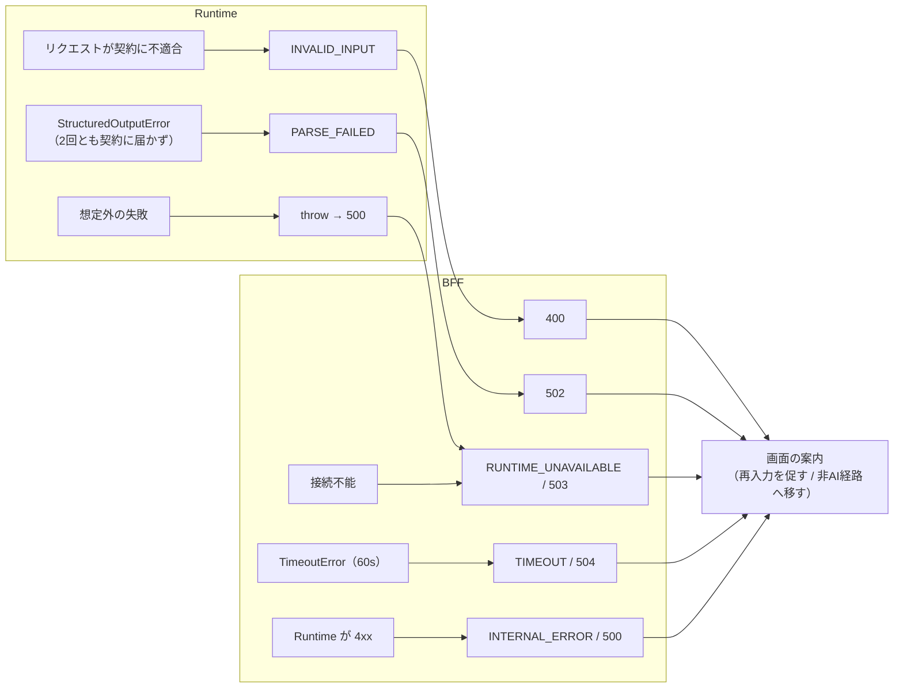
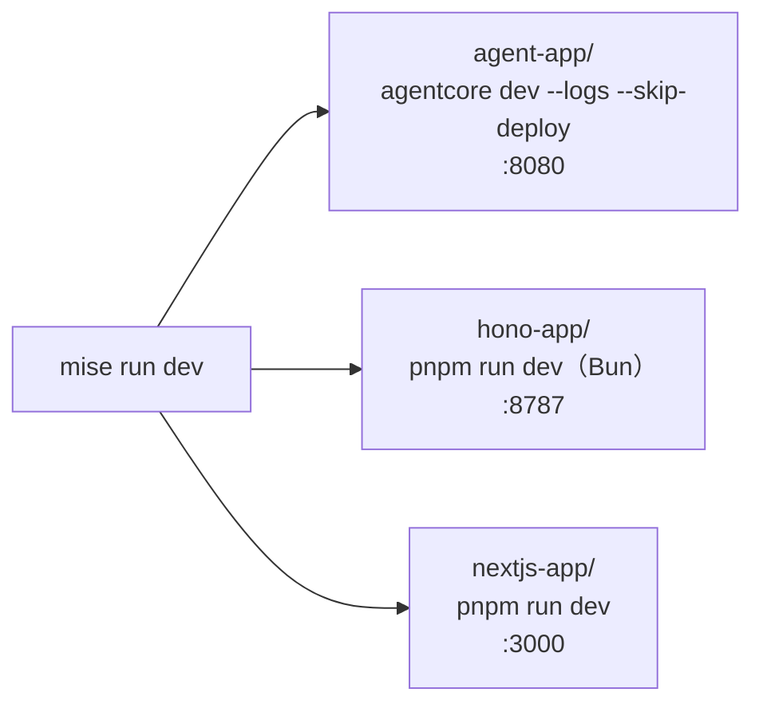

# アーキテクチャ構成図

この検証環境の構成を図にしたもの。正典はコードと ADR であり、この文書はそれを俯瞰するための地図。

## 1. 全体構成

3プロジェクトが `contracts/`（入出力契約）だけを共有し、HTTP で直列につながる。

宛先はすべて環境変数で切り替わる。

| 変数 | 置き場所 | 意味 |
| --- | --- | --- |
| `NEXT_PUBLIC_API_BASE_URL` | nextjs-app | BFF の URL（SSG なのでビルド時に埋め込まれる） |
| `FORMECHO_RUNTIME_URL` | hono-app | Runtime の URL |
| `FORMECHO_RUNTIME_CLIENT` | hono-app | `local` / `fake` |
| `FORMECHO_MODEL` | agent-app | `sonnet` / `haiku` / `fake` |

## 2. リクエスト1回の流れ

各層が何を判断するか。**判断は契約側の関数に置き、同じ判断を2箇所に書かない**（ADR-0002）。

## 3. taskId とドメインエージェント

`taskId` が唯一のルーティングキー。ドット前がドメイン、ドット後が Skill を一意に決める。

ドメイン間で協調しないので、Strands の Graph / Swarm / agent-as-tool は使わない。会議ロジは Websearch を持たない（F-22）。

## 4. contracts の解決経路

パッケージ化せず素の `.ts` で置き、各プロジェクトが自前の経路で参照する（ADR-0002）。

契約が持つ「表」。

| 表 | 決めること |
| --- | --- |
| `ALLOWED_TASK_IDS` | 受け付ける taskId |
| `checkTaskInput` | taskId ごとに自然文・構造化入力のどちらが要るか（ADR-0004） |
| `INPUT_SCHEMAS` | 構造化入力の形（ADR-0005：画面の状態を Runtime へ渡す） |
| `OUTPUT_SCHEMAS` / `outputSchemaFor` | 出力契約。入力を見ないと言えない不変条件も載る |
| `AiErrorCode` | エラーコードの語彙 |

`input`（構造化入力）が taskId ごとに運ぶもの。**サニタイズも Guardrail チェックも通さないので自由文字列を置かない** — 識別子は正規表現で縛り、参加者の実名はブラウザから出さない（ADR-0008）。

| taskId | `input` |
| --- | --- |
| `ic-card.parse-reservation` | `null`（送るべき画面状態が無い） |
| `meeting.parse-candidates` | 所要時間のみ |
| `meeting.parse-availability` | 参加形式・所要時間・候補日程の一覧 |
| `meeting.recommend-schedule` | 参加形式・所要時間・参加者の名簿・参加可否表 |

識別子はフロントエンドが発番し、AI は自分では作らない。**追加の指示のときも `input` を毎回そのまま送り直す** — Runtime 側の会話履歴はコールドスタートで消えるため、初回だけ送ると2回目が与件の無いリクエストになる（ADR-0004）。

## 5. 差し替え口（テストの決定性）

テストと実測は同じ境界を通り、違うのは設定だけにする（#40 / #41）。

差し替わるのは「Runtime が何を返したか」であって「それをどう扱うか」ではない。エラーコードへの写像と出力契約の再検査は `invokeRuntime` の1箇所を必ず通る。

## 6. エラーの写像

すべての AI 機能に**非AI経路**が確保されているので、どのエラーでも職員はフォームを埋めきれる。

## 7. 本番想定（参照アーキテクチャ・未実装）

`agent-app/agentcore/aws-targets.json` が空のため **`agentcore deploy` と `cdk synth` は実行できない**。以下は `temp/00-arch-design.md` が定める到達点であって、このリポジトリの現状ではない。

現状との差分。

- **認証** — `middleware/auth.ts` は素通し。本番は GSS / Entra の JWT 検証とテナント識別が入る
- **Runtime クライアント** — `local`（HTTP）のみ。デプロイ済み Runtime を SigV4 で叩く `deployed` を `runtime-transport.ts` に足す
- **Guardrail チェック** — 未実装。BFF ではなく Runtime のモデル呼び出し前後に置くと決めてある（ADR-0001）
- **Memory** — 会話履歴はプロセス内の LRU（128セッション）で、コールドスタートで消えるベストエフォート。永続化するなら AgentCore Memory を付ける

## 8. ローカルの3プロセス

ルートに `package.json` を置かない方針のため、この定義は `mise.toml` の `[tasks.*]` にしか置けない。
