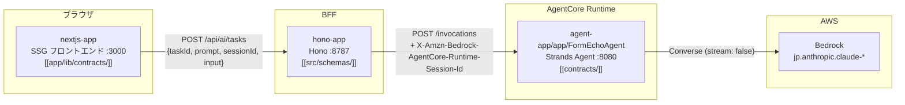
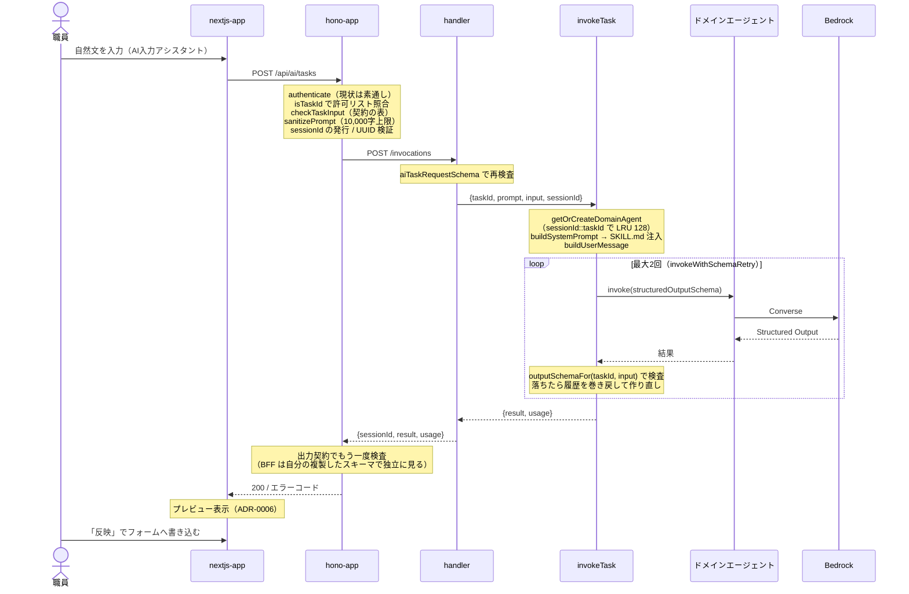
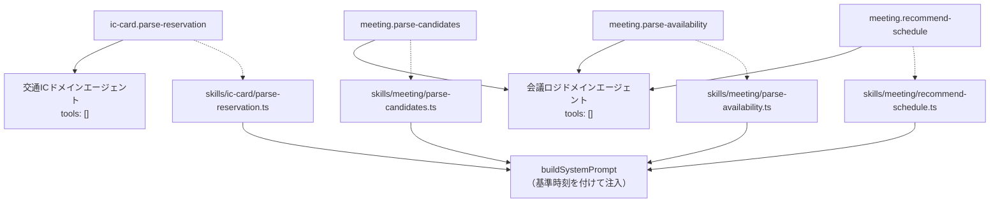
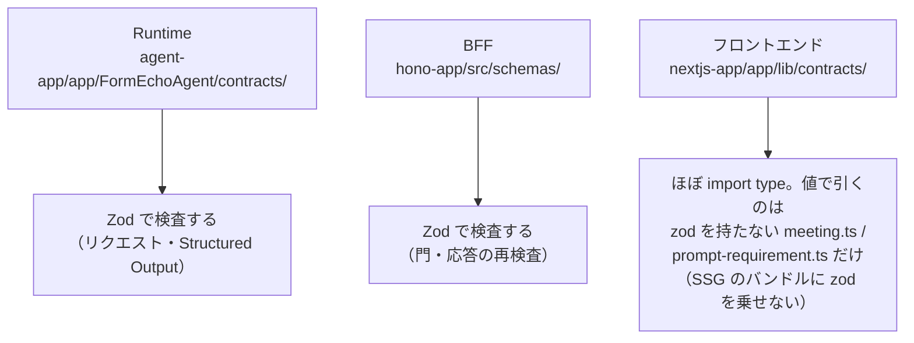
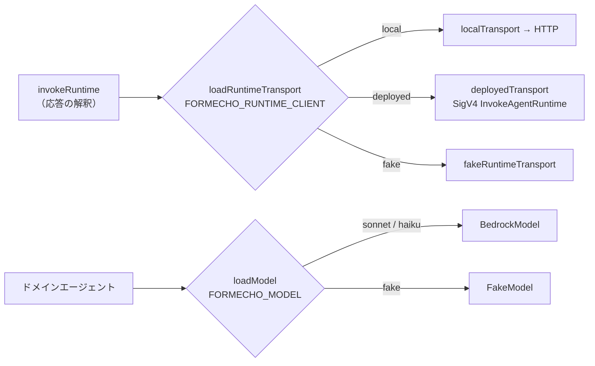
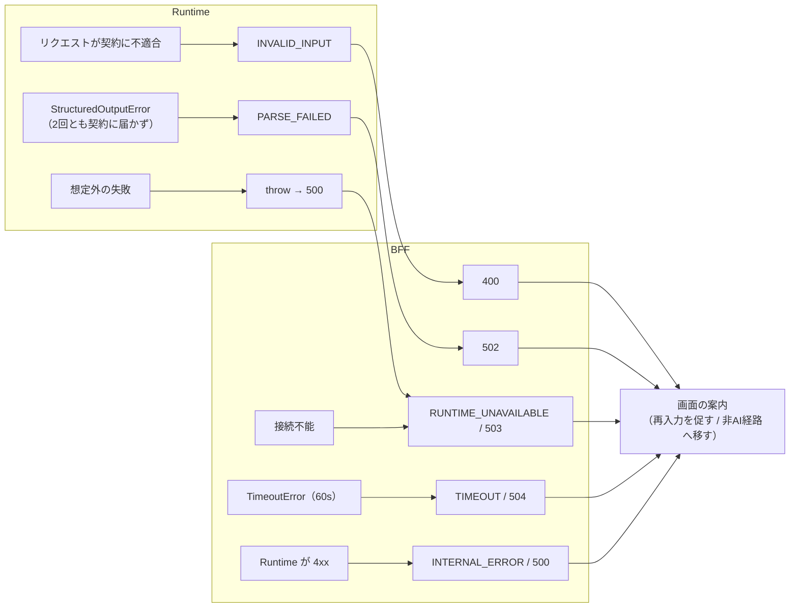
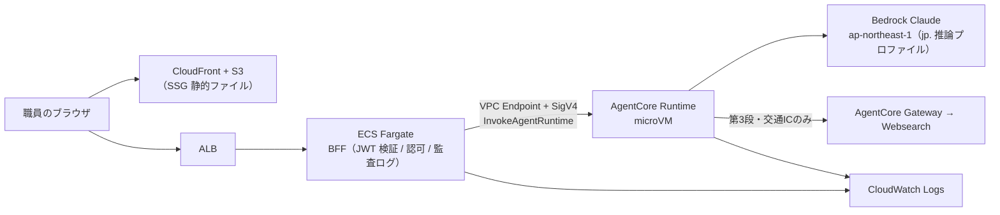
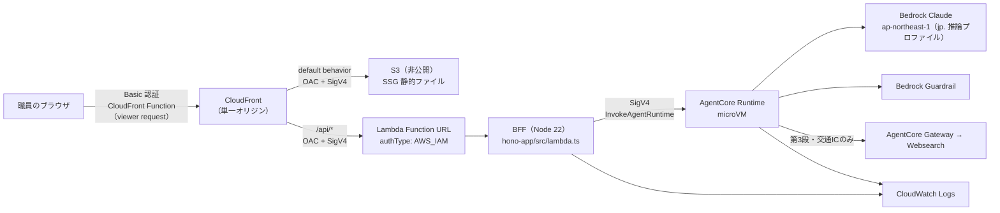
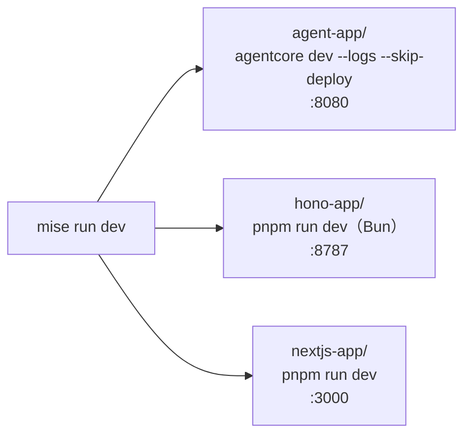

# アーキテクチャ構成図

この検証環境の構成を図にしたもの。正典はコードと ADR であり、この文書はそれを俯瞰するための地図。

## 1. 全体構成

3プロジェクトはそれぞれ入出力契約（Zod v4 スキーマ）を自己完結で持ち（ADR-0011）、HTTP で直列につながる。

宛先はすべて環境変数で切り替わる。

| 変数 | 置き場所 | 意味 |
| --- | --- | --- |
| `NEXT_PUBLIC_API_BASE_URL` | nextjs-app | BFF の URL（SSG なのでビルド時に埋め込まれる） |
| `FORMECHO_RUNTIME_URL` | hono-app | Runtime の URL |
| `FORMECHO_RUNTIME_CLIENT` | hono-app | `local` / `deployed` / `fake` |
| `FORMECHO_RUNTIME_ARN` | hono-app | デプロイ済み Runtime の ARN（`deployed` のときだけ要る） |
| `FORMECHO_MODEL` | agent-app | `sonnet` / `haiku` / `fake` |

## 2. リクエスト1回の流れ

各層が何を判断するか。**判断は各プロジェクト内の契約側の関数に置き、同じ判断をプロジェクト内の2箇所に書かない**（ADR-0011）。

## 3. taskId とドメインエージェント

`taskId` が唯一のルーティングキー。ドット前がドメイン、ドット後が Skill を一意に決める。

ドメイン間で協調しないので、Strands の Graph / Swarm / agent-as-tool は使わない。会議ロジは Websearch を持たない（F-22）。

## 4. 各プロジェクトの契約定義

共有ディレクトリは無く、3プロジェクトがそれぞれ自分のパッケージ内に複製を持つ（ADR-0011）。
複製元は同じなので現状は内容が一致しているが、3者間のドリフトを検知する自動テストは無い
（意図的。実運用で BFF の `PARSE_FAILED` 等として顕在化する）。

3プロジェクトとも自分自身の `node_modules` から `zod` を通常どおり解決する（symlink も
tsconfig の `paths` エイリアスも不要）。`recommendation.ts`（候補日提案の導出・集計）は
nextjs-app だけが持つ — 他プロジェクトは使っていないため複製していない。

契約が持つ「表」（各プロジェクトの複製に共通する内容）。

| 表 | 決めること |
| --- | --- |
| `ALLOWED_TASK_IDS` | 受け付ける taskId |
| `checkTaskInput` | taskId ごとに自然文・構造化入力のどちらが要るか（ADR-0004） |
| `INPUT_SCHEMAS` | 構造化入力の形（ADR-0005：画面の状態を Runtime へ渡す） |
| `OUTPUT_SCHEMAS` / `outputSchemaFor` | 出力契約。入力を見ないと言えない不変条件も載る |
| `AiErrorCode` | エラーコードの語彙 |

`input`（構造化入力）が taskId ごとに運ぶもの。**サニタイズも Guardrail チェックも通さないので自由文字列を置かない** — 識別子は正規表現で縛り、参加者の実名はブラウザから出さない（ADR-0008）。

| taskId | `input` |
| --- | --- |
| `ic-card.parse-reservation` | `null`（送るべき画面状態が無い） |
| `meeting.parse-candidates` | 所要時間のみ |
| `meeting.parse-availability` | 参加形式・所要時間・候補日程の一覧 |
| `meeting.recommend-schedule` | 参加形式・所要時間・参加者の名簿・参加可否表 |

識別子はフロントエンドが発番し、AI は自分では作らない。**追加の指示のときも `input` を毎回そのまま送り直す** — Runtime 側の会話履歴はコールドスタートで消えるため、初回だけ送ると2回目が与件の無いリクエストになる（ADR-0004）。

## 5. 差し替え口（テストの決定性）

テストと実測は同じ境界を通り、違うのは設定だけにする（#40 / #41）。

差し替わるのは「Runtime が何を返したか」であって「それをどう扱うか」ではない。エラーコードへの写像と出力契約の再検査は `invokeRuntime` の1箇所を必ず通る。

## 6. エラーの写像

すべての AI 機能に**非AI経路**が確保されているので、どのエラーでも職員はフォームを埋めきれる。

## 7. 本番想定（参照アーキテクチャ・未実装）

以下は `temp/00-arch-design.md` が定める到達点であって、このリポジトリの現状ではない。実際に AWS 上で動いているものは §8。

現状との差分。

- **front door** — ALB + ECS Fargate は据え置きの到達点で、デプロイ済み検証環境は CloudFront + Lambda Function URL を選んだ（ADR-0014。決め手は API Gateway の29秒ではなく時間予算そのもの）。本番へ持っていけるのは `hono-app` の中身と入出力契約であって CDK スタックではない
- **認証** — `middleware/auth.ts` は素通し。本番は GSS / Entra の JWT 検証とテナント識別が入る。検証環境はその代わりに front door の手前で Basic 認証を掛ける（#138）
- **Memory** — 会話履歴はプロセス内の LRU（128セッション）で、コールドスタートで消えるベストエフォート。永続化するなら AgentCore Memory を付ける

## 8. デプロイ済み検証環境（実装）

ブラウザから URL を開いて触れる状態。front door はルートの `infra/`（ADR-0014）、Runtime と Gateway は `agentcore deploy`、Guardrail は `agent-app/infra`（ADR-0010）が作る。

本番想定（§7）と違うところ。

- **オリジンは CloudFront 1つ。** `/api/*` がパス透過で BFF に届くので CORS が発生せず、`NEXT_PUBLIC_API_BASE_URL` は空文字（相対パス）でよい。**BFF の `cors`（`FORMECHO_ALLOWED_ORIGINS`）はここでは実質効かない**が、ローカルは :3000 → :8787 の2オリジンのままなので残してある
- **コード改修0行では済まなかった。** ADR-0014 は「フロントのコード改修は0行」で採ったが、OAC 越しの POST は本文の SHA256 を呼び出し側が `x-amz-content-sha256` に載せる必要があり、`nextjs-app/app/lib/api.ts` が `hc` に渡す `fetch` を包んでいる。BFF 側も Lambda のエントリ `hono-app/src/lambda.ts` が増えた（ルーティングと判断は `src/index.ts` に残る）
- **Function URL は公開 DNS 名だが公開エンドポイントではない。** `authType` は `AWS_IAM` で、resource policy が principal と `AWS:SourceArn` の両方でこの CloudFront に絞る。**OAC は `Authorization` を自分の署名に差し替えるので、`/api/*` の origin request policy はビューアの `Authorization` を転送しない**（Basic 認証が読むのと同じヘッダ）
- **BFF は VPC の外にいる。** Runtime を叩くのは VPC Endpoint ではなく Lambda の実行ロール（`bedrock-agentcore:InvokeAgentRuntime` を Runtime の ARN に限定）
- **時間予算は本番想定と同じ。** Runtime の自己打ち切り55秒（#125）→ BFF 60秒 → 画面60秒。CloudFront の origin response timeout 60秒はこの外側

## 9. ローカルの3プロセス

ルートの `package.json` は pnpm workspace の宣言専用でスクリプトを持たない（ADR-0015）ため、この定義は `mise.toml` の `[tasks.*]` に置く。
