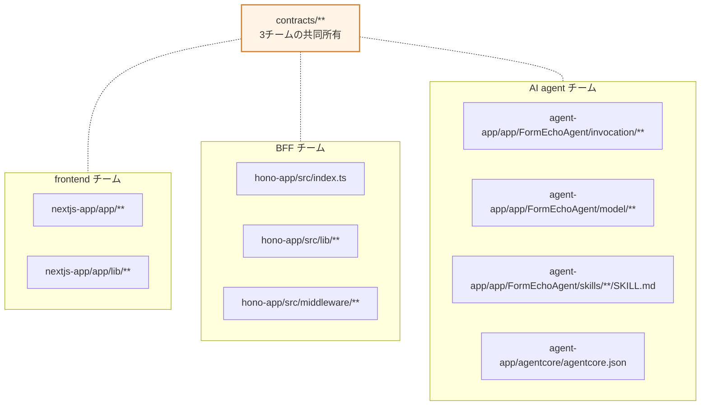
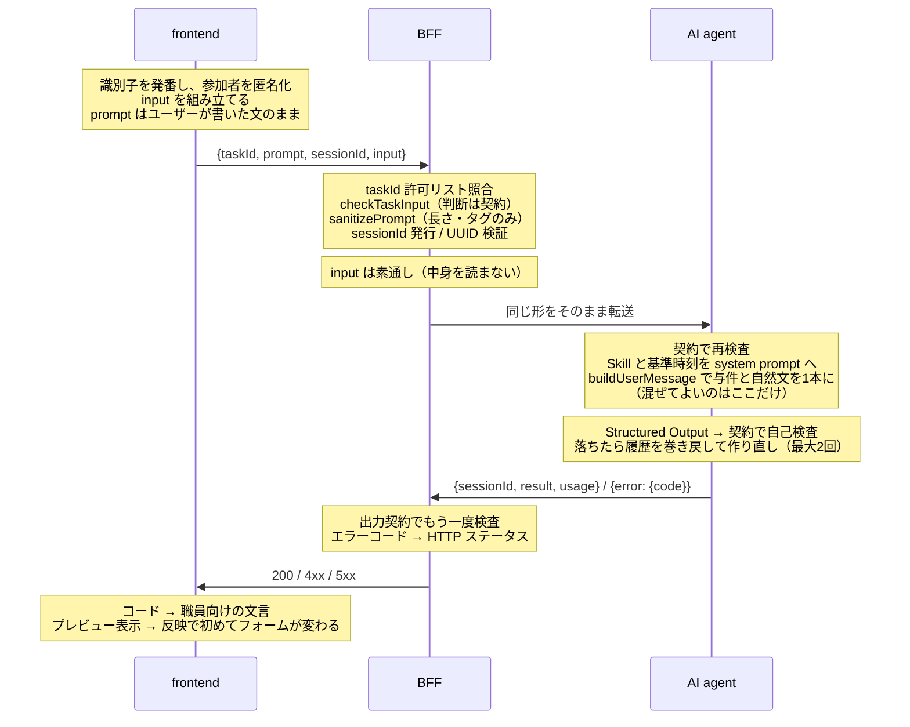

# 責務の境界（frontend / BFF / AI agent）

チームが3つに分かれているので、**どのコードを誰が書くか**と、**どの判断を誰が持つか**を分けて決める。前者はディレクトリで引ける。後者はディレクトリを跨ぐので、この文書の本体は後者。

関連 — 構成の俯瞰は `docs/architecture.md`、用語は `CONTEXT.md`、判断の根拠は `docs/adr/`。

## 0. 一行でいうと

| チーム | 持つもの | 持たないもの（一言で） |
| --- | --- | --- |
| **frontend** | 画面の状態と、職員に見せる言葉 | AI に何をどう指示するか |
| **BFF** | 境界の門番と、失敗の翻訳 | AI の中身。入力の内容の判断 |
| **AI agent** | プロンプトとモデルと、出力を契約に届かせること | HTTP と画面の言葉 |
| **（共有）`contracts/`** | 3者が同じものを見るための**判断の表** | 表示のための文言 |

**`contracts/` は誰か1チームのものではない。** ここを変える PR は3チームのレビューが要る（§5）。

## 1. コードの持ち主

生成物は誰も編集しない — `agent-app/AGENTS.md` / `README.md` / `agentcore/cdk/` / `nextjs-app/AGENTS.md`。

## 2. 責務マトリクス

リクエスト1回が通る順に、各層が**何を決めるか**。

| 関心事 | frontend | BFF | AI agent |
| --- | --- | --- | --- |
| 画面の状態モデル | ◎ 持つ（タブごとに別。共通化しない） | — | — |
| 候補日程・参加者の**識別子の発番** | ◎ 発番する | — | ✕ 作らない（渡されたものだけ使う） |
| 参加者の匿名化（実名をブラウザから出さない） | ◎ ADR-0008 | — | ✕ 実名は届かない |
| 構造化入力 `input` の組み立て | ◎ 今の画面の状態を毎回送る | ✕ 素通し（中身を作らない） | ✕ 受け取るだけ |
| 自然文 `prompt` | ◎ 職員／参加者が書いた文をそのまま | ○ 長さとタグだけ見る | ○ 見出しを付けて与件と並べる |
| taskId の許可 | ✕ | ◎ `isTaskId` を呼ぶ | ○ 契約で再検査 |
| 入力の必須性（自然文／構造化入力） | ○ 表を**引いて**ボタンを出し分ける | ◎ `checkTaskInput` を呼ぶ | ○ 契約で再検査 |
| 入力サニタイズ（長さ・タグ） | ○ `maxLength` で先回り | ◎ `sanitizePrompt` | — |
| Guardrail チェック | ✕ | ✕（ADR-0001 で外した） | ◎ 未実装。ここに置く |
| sessionId | ◎ タブごとに保持し、次の指示に添える | ◎ 発行と UUID 検証 | ◎ 会話履歴の帰属先にする |
| 認証・認可 | — | ◎ `middleware/auth.ts`（現状素通し） | — |
| プロンプト（`SKILL.md`・system prompt） | ✕ | ✕ | ◎ 単独所有 |
| モデル選択・リージョン | ✕ | ✕ | ◎ `FORMECHO_MODEL` / `jp.` 推論プロファイル固定 |
| Structured Output と作り直し | ✕ | ✕ | ◎ 最大2回・履歴の巻き戻し |
| 出力が契約に適合するかの検査 | ✕ | ◎ もう一度検査する | ◎ 作り直しの判定に使う |
| エラーコードの語彙 | ✕ | ○ 契約から引く | ○ 契約から引く |
| HTTP ステータスへの写像 | — | ◎ 単独所有 | ✕ Runtime はコードだけ返す |
| 画面に出す**文言** | ◎ 単独所有 | ✕ | ✕ |
| プレビューと反映 | ◎ ADR-0006 | — | — |
| 手入力の保護・「AIが生成」バッジ | ◎ | — | — |
| 非AI経路 | ◎ | — | — |
| トークン数の計上 | ○ 受け取って出すだけ | ○ 契約で検査して通す | ◎ 1回分だけを返す |

◎ = 決める / ○ = 引く・通す / ✕ = やってはいけない / — = 関係しない

## 3. 「やってはいけない」の一覧

境界は**やることの列挙**より**やってはいけないことの列挙**で守られる。以下は破ると他チームが黙って壊れる。

### frontend

- **契約の判断を書き写さない。** 「このタブは自然文が任意」を画面に直書きしない — `isPromptRequired(taskId)` を引く。書き写すと、契約が変わったとき送信ボタンだけが古い判断のまま残る
- **`contracts/index.js` を値として import しない。** zod が SSG のバンドルに丸ごと乗る。値で引いてよいのは zod を持たない `meeting.ts` と `prompt-requirement.ts` の2つだけ。他はすべて `import type`
- **`input` に自由文字列を置かない。** 構造化入力はサニタイズも Guardrail チェックも通らない。識別子は `/^candidate-\d{1,6}$/`、参加者は `/^参加者[A-Z]$/`（ADR-0004 / ADR-0008）
- **`prompt` に与件を埋め込まない。** 「所要時間は60分です。以下の文から…」と連結すると、入力サニタイズと Guardrail チェックが何を検査しているのか曖昧になる。与件は `input` に載せる
- **応答が来てもフォームを書き換えない。** 職員が反映を押すまでフォームは変わらない（ADR-0006）
- **BFF を飛ばして Runtime を叩かない**

### BFF

- **AI の中身に触らない。** プロンプト、モデル、Skill、Guardrail チェックはすべて Runtime 側（ADR-0001）
- **`input` の中身を解釈しない。** 検査は `checkTaskInput` に委ね、通ったものをそのまま渡す。BFF が中身を読み始めると、契約と Runtime と BFF の3箇所に同じ理解が要る
- **画面の文言を持たない。** 返すのはエラーコードと開発者向けの `message` だけ。職員に見せる案内は `nextjs-app/app/lib/error-guidance.ts`
- **未知のエラーコードを素通ししない。** `isAiErrorCode` で照合する。照合を飛ばすと `STATUS_BY_CODE[code]` が undefined になり、**エラー本文の入った 200** がブラウザへ届く
- **Runtime の失敗を握り潰さない。** タイムアウト・接続不能・4xx・5xx はそれぞれ別のコードに写す（職員に出る案内が違う）

### AI agent

- **HTTP ステータスを決めない。** handler が返すのは出力契約のエラーコードか、想定外なら例外（→ 500）。写像は BFF
- **識別子を自分で作らない。** 候補日程を指す出力は `candidate_id` だけを返し、日付や開始時刻を写さない（ADR-0005）
- **既知のコードに丸めない。** モデル呼び出しそのものの失敗（Bedrock に届かない・スロットリング）を `PARSE_FAILED` にしない — 職員に出る案内が「読み取れませんでした」に化け、同じ入力を打ち直させる
- **`jp.` 以外の推論プロファイルを使わない。** `apac.` / `global.` は国外へ推論を振る（データ主権）
- **画面の都合を Skill に書かない。** 「入力欄が空のときは」のような画面の状態は Skill の関心事ではない

## 4. リクエスト1回の中の境界

**同じ検査が2度出てくるのは重複ではない。** 契約の関数を3者が引くこと自体がこの検証環境の目的で、どこかの版がずれたら落ちるようにしてある（ADR-0002）。禁じているのは**判断を書き写すこと**であって、同じ関数を呼ぶことではない。

## 5. `contracts/` — 共同所有の縫い目

3チームが同じものを見るための表。**判断（何を受け付けるか・何で検査するか）は必ずここに置き、同じ判断を2箇所に書かない。**

| ファイル | 決めること | 変えると影響する先 |
| --- | --- | --- |
| `task-ids.ts` | 受け付ける taskId とドメインの切り出し | 3チーム全部 |
| `prompt-requirement.ts` | 自然文が必須か | frontend（ボタン）・BFF（門）・Runtime |
| `inputs.ts` | `input` の形 | frontend（組み立て）・Runtime（与件） |
| `outputs.ts` / `fields.ts` | 出力の形 | Runtime（生成）・BFF（再検査）・frontend（型） |
| `output-schema.ts` | 入力と突き合わせる不変条件 | Runtime（作り直し）・BFF（再検査） |
| `task-input.ts` | 1回分が入力契約を満たすか | BFF・Runtime |
| `errors.ts` | エラーコードの語彙 | 3チーム全部 |
| `meeting.ts` | 会議ロジの値域（zod なし） | frontend（値として引く）・契約内部 |

### 変更のルール

1. **`contracts/` を変える PR は3チームのレビューを要する。** ここだけは単独チームでマージしない
2. **文言を置かない。** 表示は UI 側の関心事（ADR-0002）。`describe()` に書くモデル向けの説明は文言ではなく指示なので置いてよい
3. **`meeting.ts` と `prompt-requirement.ts` に zod を import しない。** frontend がこの2つだけを値として引く
4. **表を1つ足すときは、対称に置く。** `INPUT_SCHEMAS` / `OUTPUT_SCHEMAS` / `PROMPT_REQUIREMENT` / `HEADINGS` は同じ形をしている。片方だけ別の形にすると taskId を足すときの編集箇所が読めなくなる
5. **taskId を1つ足す変更は3チーム同時。** 許可リスト・入出力スキーマ・`SKILL.md`・タブ・文言がすべて要る。縦に割って1チームずつ進めない

## 6. 判断表 — この変更は誰の仕事か

| 変えたいもの | 主担当 | 巻き込む相手 |
| --- | --- | --- |
| 抽出の精度が悪い | AI agent | — （`SKILL.md` と system prompt だけで閉じる） |
| AI が入力に無い候補日程を返す | AI agent | 契約（`output-schema.ts` の検査を強める場合） |
| 出力に欄を1つ足す | 契約 → AI agent → frontend | BFF は再検査を通すだけ |
| 画面に渡す与件を1つ足す | frontend → 契約 → AI agent | BFF は素通し |
| エラー時の案内文を変える | frontend | — |
| 新しいエラーの種類を出す | 契約（コード追加）→ BFF（写像）→ frontend（文言） | AI agent（Runtime が出す種類なら） |
| タイムアウトを延ばす | BFF | AI agent（Runtime 側の実測が要る） |
| 認証を入れる | BFF | frontend（トークンの付与） |
| Guardrail チェックを入れる | AI agent | 契約（`GUARDRAIL_BLOCKED` 追加）→ BFF → frontend |
| デプロイ済み Runtime を叩く | BFF（`deployed` transport） | AI agent（`aws-targets.json`） |
| Websearch を足す | AI agent | 契約（`sources` は既にある） |
| タブを1つ足す | 3チーム同時 | — |

## 7. チーム間の約束（破ると相手が黙って壊れる）

- **`input` は追加の指示のときも毎回そのまま送る。** Runtime の会話履歴はコールドスタートで消えるので、初回だけ送ると2回目が与件の無いリクエストになる（ADR-0004）
- **`sessionId` は成功応答が返したものを次に渡す。** これが追加の指示を同じ会話の続きとして届ける唯一の手立て。`input` が運ぶのは画面の**今の**状態だけで、前に何を指示したかは Runtime 側の履歴にしかない
- **会話履歴はベストエフォート。** プロセス内の LRU（128セッション）で、コールドスタートで消える。永続化が要るなら AgentCore Memory を足す判断が要る
- **抜けの扱いが taskId ごとに逆。** 参加可否は抜けを許して重複だけ弾く（答えられなかったことは事実）、候補日提案は過不足なく対応することを要求する（評点の無い候補日程は画面に無印で並ぶ）
- **未定 ≠ 未回答。** 未定は参加者が答えた結果、未回答は回答の不在（参加可否表のセルが存在しないこと）。3チームとも同じ区別で書く
- **BFF の `message` は開発者向け。** 職員に見せる文言ではない。frontend はコードだけを見て文言を引く

## 8. テストの分担

| チーム | 何をテストするか | 差し替えるもの |
| --- | --- | --- |
| frontend | 反映の写し方・手入力の保護・プレビューの一覧・参加可否表の導出 | なし（`app/lib/**` を素の関数として呼ぶ。コンポーネントは描かない） |
| BFF | 門の判断・エラーコードへの写像・出力契約の再検査 | `FORMECHO_RUNTIME_CLIENT=fake` |
| AI agent | invocation 境界・作り直し・与件の組み立て | `FORMECHO_MODEL=fake` |

frontend が差し替えを持たないのは、AI 由来の判断が `app/lib/**` の純粋な関数に出してあり、そこを直接呼べば BFF も Runtime も要らないため。**タブごとの状態モデルをここへ出しておくことが、frontend にとってのシームの作り方になる。**

**テストのために新しいシームを作らない。** 差し替えるのは既にある設定の選択肢だけで、テストと実測は同じ境界を通る（#40 / #41）。`fake` に差し替わるのは「Runtime／モデルが何を返したか」であって「それをどう扱うか」ではない。

CI で回すコマンドは `CLAUDE.md`「変更を出す前の確認」の表にある。**自分のプロジェクトのぶんだけ回して済ませない** — `contracts/` を触った PR は3つとも回す。

## 9. 未確定（決めるのは人）

- **監査ログ** — 参照アーキは BFF の責務としている（職員ID・taskID・入力・出力・トークン数）。現状どのチームも実装していない
- **Guardrail チェック** — 置き場所は Runtime と決まっている（ADR-0001）が、実装チケットは未着手。`GUARDRAIL_BLOCKED` を契約へ足すところから3チームに波及する
- **認証** — `middleware/auth.ts` は素通し。JWT を入れると frontend にトークン付与の責務が生まれる
